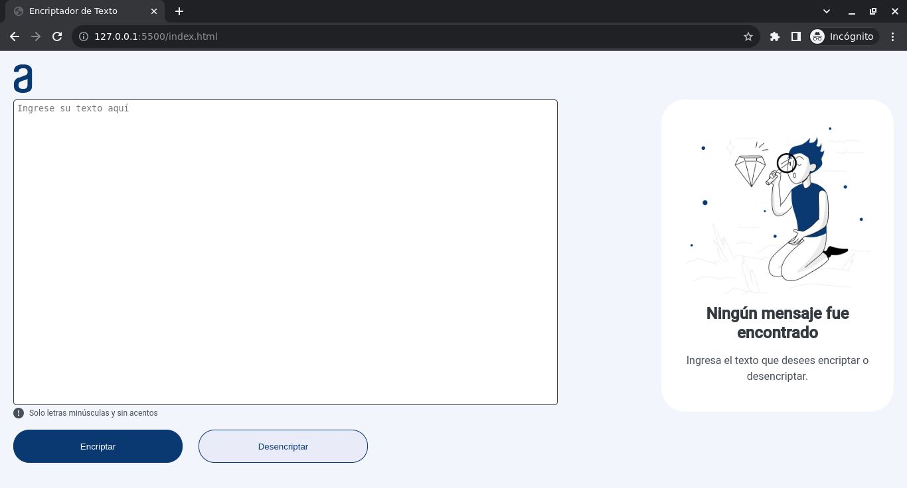
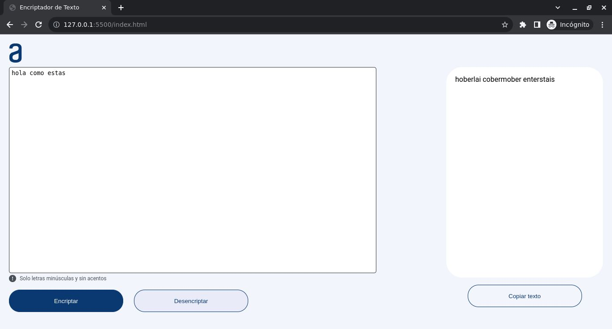
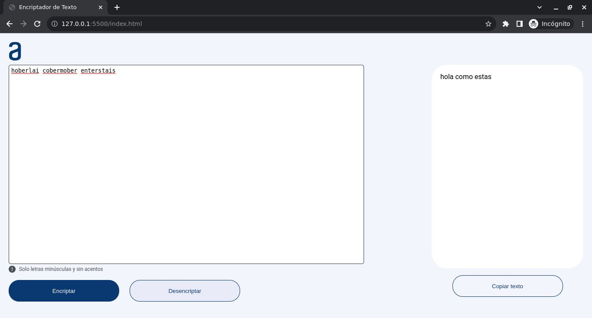

# Encriptador de Texto

Este proyecto es una aplicación web que funciona como encriptador de texto. La encriptación consiste en encriptar las vocales del texto introducido. El texto no puede contener caracteres especiales ni mayúsculas.

La aplicación también permite desencriptar el texto de la misma forma, el usuario ingresa el texto a desencriptar y selecciona el botón correspondiente.
La interfaz gráfica es responsiva y funcional en dispositivos tales como PCs, tablets y celulares.

## Tecnologías usadas

* HTML
* CSS
* JavaScript
* SASS

## Claves de encriptación

Clave | Encriptación
---   | ---
a     | ai
e     | enter
i     | imes
o     | ober
u     | ufat

## Claves de desencriptación

Clave    | Desencriptación
---      | ---
ai       | a
enter    | e
imer     | i
ober     | o
ufat     | u

## Interfaz gráfica

* Pantalla inicial

* Pantalla de encriptado

* Pantalla de desencriptado

## Despliegue de la aplicación
Se puede visitar la aplicación web desde el despliegue de GitHub Pages: <a href="https://amosmvl2261.github.io/EncriptadorTexto/">Link</a>.

Si se desea ejecutar la aplicación de forma local, esta fue desarrollada en visual studio, y se recomienda hacer uso de este IDE para su despliegue haciendo uso servidor local tal como live server a través de las extensiones de visual studio code, sin embargo, se puede hacer uso de cualquier servidor que cumpla esta función para el despliegue.
